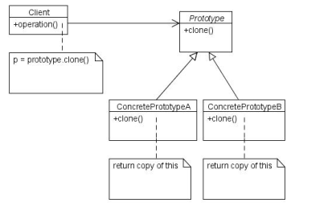

# Prototype Pattern

## Definition
The Prototype pattern is basically the creation of new instances through
cloning existing instances. By creating a prototype, new objects are created
by copying this prototype.

## Where to use
##### When a system needs to be independent of how its objects are created,composed, and represented.
##### When adding and removing objects at runtime.
##### When specifying new objects by changing an existing objects structure.
##### When configuring an application with classes dynamically.
##### When keeping trying to keep the number of classes in a system to a minimum.
##### When state population is an expensive or exclusive process.

## Benefits
##### Speeds up instantiation of large, dynamically loaded classes.
##### Reduced subclassing.

## Drawbacks/consequences
Each subclass of Prototype must implement the Clone operation. Could be
difficult with existing classes with internal objects with circular references or
which does not support copying.

## Structure
