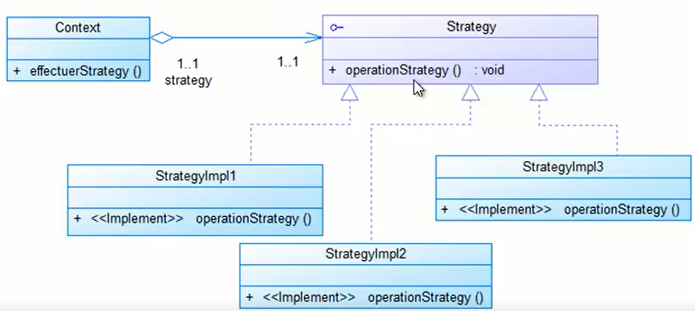

# Strategy Pattern

## Definition
Use strategy when you need to define a family of algorithms, encapsulate
each one, and make them interchangeable. Strategy lets the algorithm vary
independently from clients that use it. Related patterns include State,
Flyweight, Decorator, Composite.

## Where to use
##### When you need to use one of several algorithms dynamically.
##### When you want to configure a class with one of many related classes (behaviors).
##### When an algorithm uses data that clients shouldn't know about.

## Benefits
##### Reduces multiple conditional statements in a client.
##### Hides complex, algorithmic-specific data from the client.
##### Provides an alternative to subclassing.
##### Can be used to hide data that an algorithm uses that clients shouldn't know about.

## Drawbacks/consequences
##### Clients must be aware of different strategies. A client must understand how
strategies differ before it can select the appropriate one.
##### Increases the number of objects in an application.

## Example
