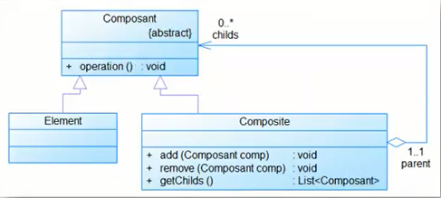

# Composite Pattern

## Definition
The Composite pattern helps you to create tree structures of objects without
the need to force clients to differentiate between branches and leaves
regarding usage. The Composite pattern lets clients treat individual objects
and compositions of objects uniformly.

## Where to use
##### When you want to represent a part-whole relationship in a tree structure.
##### When you want clients to be able to ignore the differences between compositions of objects and individual objects.
##### When the structure can have any level of complexity and is dynamic.

## Benefits
##### Define class hierarchies consisting of primitive objects and composite objects.
##### Makes it easier to add new kind of components.

## Drawbacks/consequences
The Composite pattern makes it easy for you to add new kinds of components
to your collection as long as they support a similar programming interface. On
the other hand, this has the disadvantage of making your system overly
general. You might find it harder to restrict certain classes where this would
normally be desirable.

## Structure
