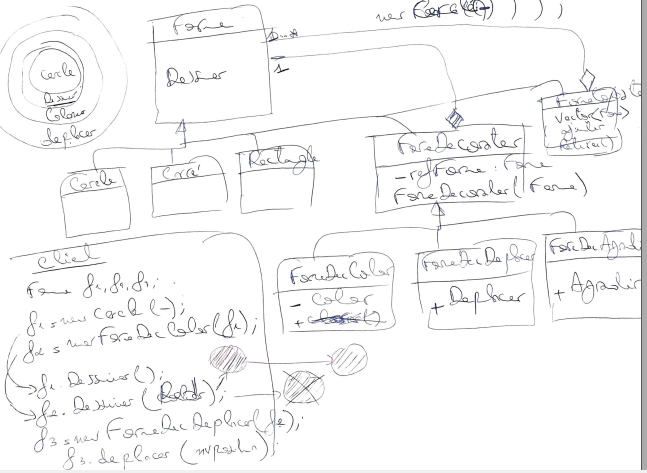

# Decorator Pattern

## Definition
The Decorator pattern lets you attach additional responsibilities and modify
an instance functionality dynamically. Decorators provide a flexible
alternative to subclassing for extending functionality, using composition
instead of inheritance.

## Where to use
##### When you want to add responsibilities to individual objects dynamically and transparently, without affecting the original object or other objects.
##### When you want to add responsibilities to the object that you might want to change in the future.
##### When extension by static subclassing is impractical.

## Benefits
##### More flexibility than static inheritance.
##### Avoids feature-laden classes high up in the hierarchy.
##### Simplifies coding because you write a series of classes each targeted at a specific part of the functionality rather than
##### coding all behavior into the object.
##### Enhances the object's extensibility because you make changes by coding new classes.

## Drawbacks/consequences
One thing to keep in mind when implementing the Decorator pattern is that
you need to keep the component interface simple. You want to avoid making
the component interface overly complex, because a complex interface will
make it that much harder to get each decorator right.
Another potential drawback of the Decorator pattern is the performance
overhead associated with a long chain of decorators.

## Example
