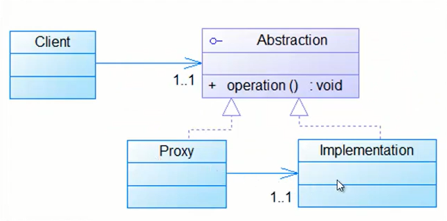

# Proxy Pattern

## Definition
A Proxy is a structural pattern that provides a stand-in for another object in
order to control access to it.

## Where to use
##### When the creation of one object is relatively expensive it can be a good idea to replace it with a proxy that can make sure that instantiation of the expensive object is kept to a minimum.
##### Proxy pattern implementation allows for login and authority checking before one reaches the actual object that's requested.
##### Can provide a local representation for an object in a remote location.

## Benefits
Gives the ability to control access to an object, whether it's because of a
costly creation process of that object or security issues.

## Drawbacks/consequences
Introduces another abstraction level for an object, if some objects accesses
the target object directly and another via the proxy there is a chance that
they get different behavior this may or may not be the intention of the
creator.

## Example
