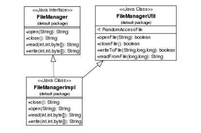

# Adapter Pattern
Also known as Wrapper.

## Definition
The Adapter pattern is used to translate the interface of one class into
another interface. This means that we can make classes work together that
couldn't otherwise because of incompatible interfaces. A class adapter uses
multiple inheritance (by extending one class and/or implementing one or
more classes) to adapt one interface to another. An object adapter relies on
object aggregation.
## Where to use
##### When you want to use an existing class, and its interface does not match the one you need.
##### When you want to create a reusable class that cooperates with unrelated or unforeseen classes, that is, classes that don't necessarily have compatible interfaces.
##### When you want to increase transparency of classes.
##### When you want to make a pluggable kit.

## Benefits
##### Highly class reusable.
##### Introduces only one object

## Drawbacks/consequences
When using Java, Target must be an interface.

## Example
